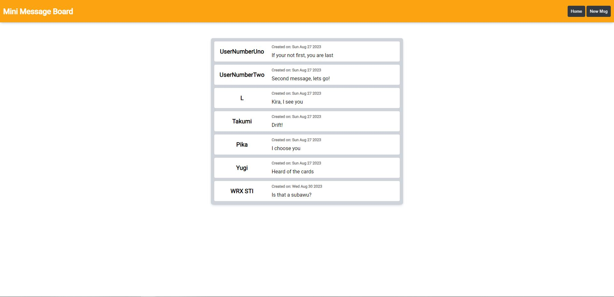
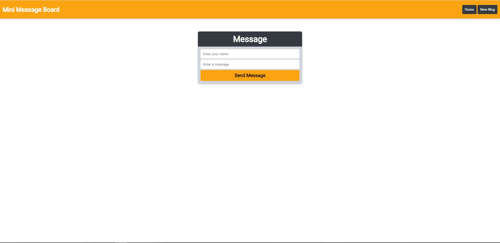

# TheOdinProject - Project: Mini-Message Board

This is a solution to the [Project: Mini Message Board](https://www.theodinproject.com/lessons/nodejs-mini-message-board). 

## Table of contents

- [Overview](#overview)
  - [The challenge](#the-challenge)
  - [Screenshot](#screenshot)
  - [Links](#links)
- [My process](#my-process)
  - [Built with](#built-with)
  - [What I learned](#what-i-learned)
  - [Continued development](#continued-development)
  - [Useful resources](#useful-resources)
- [Author](#author)


## Overview

### The challenge

Users should be able to:

- Build an app that uses express and mongodb for the database
- Create and object data to send to the database
- View data from the database to the webpage


### Screenshot





### Links

- Solution URL: [https://github.com/TheLegend760/MiniMsgBoard-TheOdinProject]
- Live Site URL: [Add live site URL here]

## My process

### Built with

- Semantic HTML5 markup
- CSS custom properties
- Flexbox
- CSS Grid
- [NodeJS]
- [Express]
- [MongoDB]


### What I learned

Having to use a express template made the process easy because it set everything up to where it should be. EJS at first was intimidating because it was weird how you had to exit out on certain lines with its EJS brackets. Luckily there was a EJS language support to make it easy on Visual Studios. I am proud that I was able to create, learn, and use Schema because it looked difficult at first because I was so used to firebase. I was able to learn, once you use moongose.connect() you can pass on moongose functions like find() and create as long as you use mongoose.model() on the subcollection you are trying to access. 


```js
const msgSchema = new Schema({
    user: {
        type: String,
        required: true
    },
    userMsg: {
        type: String,
        required: true
    },
}, {timestamps: true});

const UserMsg = mongoose.model('messages', msgSchema);

router.get('/', async function(req, res, next) {
  try {
    // Find userMsg data and sort createdAt by accending order
    const data = await UserMsg.find().sort({createdAt: 1});
    res.render('index', { title: 'Mini Msg Board | Home', data});
  } catch(err) {
    console.log(err);
  }
});

router.post('/', async function(req, res, next) {
  try {
    // Create new message from form and send it to mongodb collection
    try {
      const newMsg = new UserMsg({
        user: req.body.user,
        userMsg: req.body.userMsg
      });

      await UserMsg.create(newMsg);
    } catch(err) {
      console.log(err);
    }

    res.redirect('/');
  } catch(err) {
    console.log(err)
  }
});

```


### Continued development
I would like to do more Expressjs projects so I am able to get more familiar with it. I also like  the React framework and intrested in learning MERN, which combines Nodejs with React due to React being easy to create webpages.


### Useful resources

- [Stackoverflow](https://www.stackoverflow.com) - Searching on this website allowed me to figure out how ejs functions work
- [Net Ninja Youtube](https://www.youtube.com/watch?v=-foo92lFIto) - Watching this video allowed me to learn on how to to get data and post data to mongodb


## Author

- Twitter - [@CoverKevo](https://www.twitter.com/CoderKevo)
- Email - [kevin760g@gmail.com]
